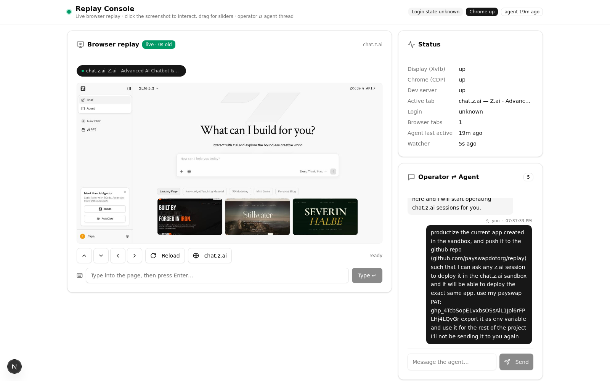

# Replay

**A live browser you drive from a web page.** Replay runs a real Chrome on a
virtual display (Xvfb), streams screenshots of it into a Next.js page, and
forwards your clicks, drags, typing, scrolling and tab switches back into the
browser over the Chrome DevTools Protocol. The result: you can use any website
— including login flows, slider CAPTCHAs and multi-tab auth popups — from
inside a single web console, with an operator ⇄ agent message thread on the
side.



## Features

- **Live replay** — JPEG frames of the real browser, polled every 2.5 s
  (blob URLs, last frame kept on error).
- **Pixel-exact interaction** — click, double-target drag (slider CAPTCHAs),
  scroll, reload, navigate, and a "type into the page" box.
- **Multi-tab management** — tab chips, one-click switching, auto-select of
  newly opened tabs (auth popups), active tab persisted across restarts.
- **Operator ⇄ agent thread** — JSONL-backed message thread between the human
  operator and a resident agent, with heartbeats.
- **Self-healing** — a 60 s watchdog restarts dead Xvfb / Chrome / dev server,
  auto-accepts JavaScript dialogs, and maintains a target-site session
  registry.
- **Persistent login** — the Chrome profile survives restarts, so you log in
  once (credentials are never seen by the app).

## Architecture

```
┌────────────────────────── Next.js (port 3000) ──────────────────────────┐
│  / (console UI)      poll /api/frame →  blob URLs                  │
│                      click/drag/type → POST /api/event                  │
│                      GET /api/tabs, /api/status, /api/inbox             │
│  /api/* routes  ─── execFile(buffer) ───►  scripts/bridge.py            │
└──────────────────────────────────────────────────│──────────────────────┘
                                                   │ CDP (websocket, :9222)
                                   ┌───────────────▼──────────────┐
                                   │ Chrome for Testing (headed)  │
                                   │ user-data-dir: browser-profile│
                                   │ window 1440×900 on Xvfb :99  │
                                   └──────────────────────────────┘
 scripts/watcher.py  — 60 s cycle: restart dead processes, auto-accept
                       dialogs, auto-select new tabs, session registry,
                       operator-inbox log, heartbeats
 scripts/flags/      — active tab, inbox/outbox JSONL, heartbeats, registry
```

The Python side needs only **websocket-client** (stdlib otherwise). Chrome is
auto-detected from the Playwright cache, `CHROME_BIN`, or `PATH`.

## Deploy (z.ai sandbox)

Any z.ai session can deploy the exact same app with these commands:

```bash
# 1. Clone (public repo — for a private repo use your token in the URL,
#    e.g. https://<TOKEN>@github.com/payswapdotorg/replay.git)
git clone --depth 1 https://github.com/payswapdotorg/replay.git /tmp/replay

# 2. Bootstrap: copies into /home/z/my-project (INSTALL_DIR), installs
#    websocket-client + bun deps, creates the SQLite db, starts
#    Xvfb + Chrome + watcher, and verifies everything
INSTALL_DIR=/home/z/my-project bash /tmp/replay/scripts/bootstrap.sh

# 3. If the sandbox platform hasn't already started the dev server:
cd /home/z/my-project && nohup bun run dev >>dev.log 2>&1 &
```

Open the sandbox preview on port `3000` — you'll see the console with the
target site already loaded in the replay panel.

If the repo is **already checked out** at the project root (e.g. via
`git reset --hard origin/main` inside an existing `/home/z/my-project`
checkout), just run:

```bash
bash scripts/bootstrap.sh
```

`bootstrap.sh` is fully idempotent — rerunning it never duplicates daemons.

## Local development (any Linux with Chrome)

```bash
bun install
python3 -m pip install websocket-client
bash scripts/bootstrap.sh
bun run dev        # http://localhost:3000
```

Requirements: Linux, Chrome/Chromium, Xvfb, Python 3, Bun.

## Configuration

| Env var        | Default                 | Purpose                                    |
| -------------- | ----------------------- | ------------------------------------------ |
| `TARGET_URL`   | `https://chat.z.ai/`    | Page Chrome opens first & quick-nav target |
| `CHROME_BIN`   | auto-detected           | Chrome/Chromium binary path                |
| `PYTHON_BIN`   | `/home/z/.venv/bin/python3` | Python with `websocket-client`        |
| `PROJECT_ROOT` | `process.cwd()`         | Repo root for API routes                   |
| `INSTALL_DIR`  | repo checkout           | Deploy target for `bootstrap.sh`           |
| `DATABASE_URL` | `file:./db/custom.db`   | SQLite for Prisma (scaffold models)        |

## HTTP API

| Route            | Method    | Description                                        |
| ---------------- | --------- | -------------------------------------------------- |
| `/api/frame`     | GET       | JPEG screenshot of the active tab (binary)         |
| `/api/event`     | POST      | `click`·`dblclick`·`drag`·`scroll`·`type`·`key`·`enter`·`nav`·`reload` |
| `/api/tabs`      | GET / POST| List tabs / set the active tab (`{id}`)            |
| `/api/status`    | GET       | Processes, active tab, login state, heartbeats     |
| `/api/inbox`     | GET / POST| Operator⇄agent thread (append `{text}`)            |

## Hard-won implementation notes

These are the reasons the console works where naive attempts fail:

1. **Screenshots must travel as buffers.** `bridge.py frame` writes raw JPEG
   bytes to stdout and the Node side uses `execFile` with
   `encoding: "buffer"`. Routing them through a UTF-8 string corrupts them.
2. **Never hardcode viewport coordinates.** The real viewport (e.g.
   1439×756) differs from the requested window (1440×900). The UI maps click
   positions via `img.naturalWidth / naturalHeight`.
3. **Events must target the ACTIVE tab.** Auth flows open new tabs; the
   active tab id is persisted in `scripts/flags/active_tab.txt` and every
   frame/event resolves it fresh (by URL/title match after navigation).
4. **Slider CAPTCHAs need drags.** `drag` presses, interpolates 12 moves with
   the button held (20 ms apart), then releases — a plain click cannot solve
   them.
5. **Chrome rejects websocket handshakes with an Origin header** — the CDP
   client connects with `suppress_origin=True`.
6. **Detached daemons.** Xvfb, Chrome and the watcher are started with
   `start_new_session=True` (orphaned to init) so they survive the shell.

## Repository layout

```
scripts/
  bootstrap.sh      one-command cold start (idempotent)
  start_stack.py    Xvfb + Chrome launcher
  start_watcher.py  self-healing watcher wrapper (idempotent)
  watcher.py        60 s watchdog cycle
  channel.py        minimal CDP client (HTTP + websocket)
  bridge.py         CLI bridge used by the API routes
  procs.py          process management + chrome auto-detection
  testpage.html     calibration page for click/drag tests
  RECOVERY.md       cold-start runbook for sandbox resets
src/
  app/page.tsx      the console UI (only user-visible route)
  app/api/*         frame / event / tabs / status / inbox routes
  lib/bridge.ts     execFile bridge (buffer-safe)
docs/screenshot.png
```

## Security notes

- The Chrome profile (`scripts/browser-profile/`) holds login cookies and is
  **git-ignored** — secrets never leave the machine.
- `scripts/env.sh` (optional local secrets) is chmod 600 and git-ignored.
- Runtime state (`scripts/flags/`, logs, pid files) is git-ignored.
- No credentials are ever handled by the app: the operator types them into
  the replayed page like on a normal browser.

## License

MIT — see [LICENSE](LICENSE).
